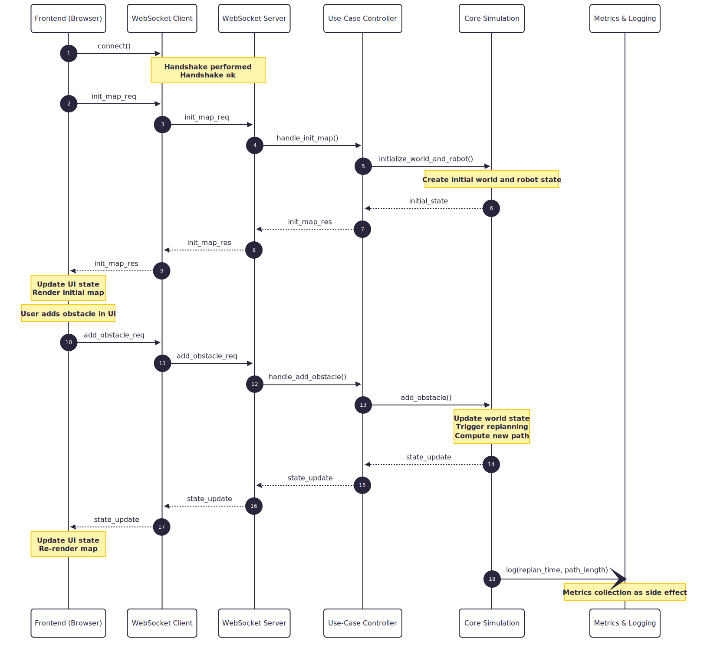

# Path Planning Simulation with Dynamic Replanning

This repository contains a modular simulation framework for **robot path planning in dynamic environments**.
The system is designed to demonstrate and analyze **adaptive replanning behavior** when the environment changes
at runtime (for example, when obstacles are added or removed).

The project is developed in the context of a bachelor thesis and focuses on **clean architecture**, **clear
responsibility separation**, and **traceable system behavior**, rather than on production-level optimization.

---

## Project Goals

The main goals of this project are:

- Demonstrate static and dynamic path planning in a grid-based or graph-based world model
- Show how replanning is triggered by environmental changes
- Separate visualization concerns from simulation and planning logic
- Enable reproducible evaluation using clearly defined metrics
- Provide a comprehensible architecture suitable for academic documentation

The frontend serves purely as a visualization and interaction layer.
All simulation, planning, and evaluation logic is executed in the backend.

---

## System Overview

The application follows a **layered architecture** with strict dependency directions.
Each layer has a single, well-defined responsibility and communicates only through
explicit interfaces.

### Architecture & Layer Diagram




### Layer Responsibilities

#### Frontend (Browser)
- Renders the current world state and robot path using D3
- Maintains UI-related state only
- Translates user interactions into commands
- Does not contain domain or simulation logic

#### WebSocket Layer
- Provides bidirectional communication between frontend and backend
- Acts purely as a transport and adapter layer
- Does not perform routing or business logic

#### Backend Application Layer
- Routes incoming messages to application use cases
- Orchestrates interactions between frontend requests and the core domain
- Contains no domain logic itself

#### Core Domain
- Holds the world model and robot state (source of truth)
- Executes simulation steps
- Performs path planning and replanning
- Emits updated state snapshots

#### Metrics & Logging
- Collects evaluation data as side effects
- Does not influence control flow or decision making
- Enables later analysis of replanning behavior

---

## Runtime Behavior

While the architecture diagram shows **static dependencies**, the actual system behavior
is best explained using a **sequence diagram**.

Two main runtime scenarios are relevant:

1. Initialization of the world and initial path planning
2. Dynamic replanning triggered by environmental changes

### Sequence Diagram: Initialization and Replanning



### Interaction Flow Summary

1. The frontend establishes a WebSocket connection to the backend
2. The frontend sends a command (e.g. initialize map or add obstacle)
3. The backend routes the command to the appropriate use case
4. The use case invokes core domain operations
5. The core domain updates its state and triggers replanning if required
6. A state update is sent back to the frontend
7. The frontend updates its UI state and re-renders the visualization

Metrics are collected during simulation and replanning but do not affect the control flow.

---

## Architectural Principles

The system is designed according to the following principles:

- Separation of concerns between UI, transport, application logic, and domain logic
- Single source of truth located in the core domain
- Event-driven behavior for dynamic replanning
- Backend-first design with frontend as a visualization client
- Traceability of decisions and performance metrics

---

## Repository Structure (Overview)

```
frontend/          Frontend visualization and UI logic
backend/           WebSocket server and application layer
core/              Simulation, world model, and path planning
docs/              Documentation, diagrams, and thesis-related material
docs/ticket-sys/   Lightweight ticket system used during development
```

---

## Core Import Conventions

- `Position` exists exactly once at `core.domain.position.Position` and is re-exported via `core.domain.Position`.
- Feature modules (planning, simulation, experiments, and upcoming CLI/metrics runners) should import domain/public APIs from package roots, e.g. `from core.domain import Position` and `from core.simulation import SimulationEngine`.
- Avoid deep imports in new components unless extending the same package internals; this keeps public paths stable and prevents accidental circular dependencies.


## Experiment Matrix Runner (6 Szenarien × 4 Policies)

Für einen vollständigen Batch-Lauf (24 Runs) steht ein Python-Skript bereit:

```bash
python3 experiments/run_experiment_matrix.py --out-dir experiments/runs/matrix
```

Erzeugte Artefakte:
- `matrix_summary.csv` mit den Spalten `Scenario, Policy, total_cost, ticks, replans, goal_reached`
- `matrix_summary.json` mit denselben aggregierten Daten
- pro Run eine JSON-Datei `<scenario>__<policy>.json`

Optional kannst du u. a. Policies einschränken oder Parameter setzen (für `periodic` muss `--periodic-interval` explizit gesetzt werden):

```bash
python3 experiments/run_experiment_matrix.py \
  --policies static_once event_based periodic path_affected \
  --periodic-interval 5 \
  --path-affected-threshold 0.0
```

## Notes

This README intentionally focuses on **architecture and system behavior**.
Implementation details, algorithms, and evaluation results are documented separately
as part of the bachelor thesis.
